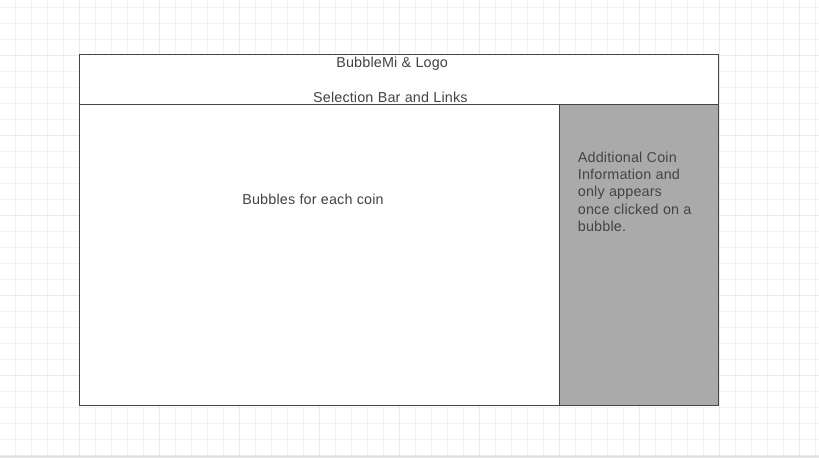

# BubbleMi

## Background

BubbleMi is a data visualization of top cryptos using API to fetch data and presenting the information using a bubble chart.  The bubbles will have varying sizes depending on the descriptions pick by the user, ex. All Time High, All Time Low, Price Change % 24 Hr, Market Cap, etc.  The colors of the bubble will also change depending on description.  Clicking on each bubble will present the user with additional information about each coin.  

## Functionality

In BubbleMi, users will be able to:

* Select the type of information to use to chart the bubbles
* Click on the bubble to show additional information on each coin
    * Links to cryptocurrency exchanges to buy crypto
* Click and drag to move bubbles as they wish
* Click and select colors to show their bubbles 

## Wireframe

* Display page name and logo in HTML headings with links to this project's Github repo and my LinkedIn
* Nav Bar includes clickable selection to show bubble in 24Hr % change and Market Capitalization, also clickable to filter number of coins to show based on Market Capitalization
* Generates bubbles for each coin, bubbles will be split between if the coin is up or down for the day, user will have the ability to move the bubbles around, but the bubbles will slowly move back to it's desired location
* Additional coin information will be shown on the right of the screen once a bubble is clicked on

## Technologies, Libraries, APIs:
### Will be using the following on this project: 
* CoinGecko's API to fetch real time data: https://www.coingecko.com/en/api/documentation
* D3's Circular Packing libraries to generate bubbles and data presentation: https://d3-graph-gallery.com/circularpacking.html
* Webpack to bundle JavaScript code
* npm

## Implementation Timeline: 

* Friday Afternoon & Weekend - Start project, install all dependencies.  Create bubbles and implementing bubble logic according to data fetched.  Create additional information side and have it only to appear when clicked.  
* Monday - Implement nav and selection bar, with the chart reacting to selections clicked.  
* Tuesday - Implement drag and drop logic as well as group features logic
* Wednesday - Work on styling, visualization, and color scheme.  Work on bonus if there's time.  
* Thursday Morning - Push to GitHub report

