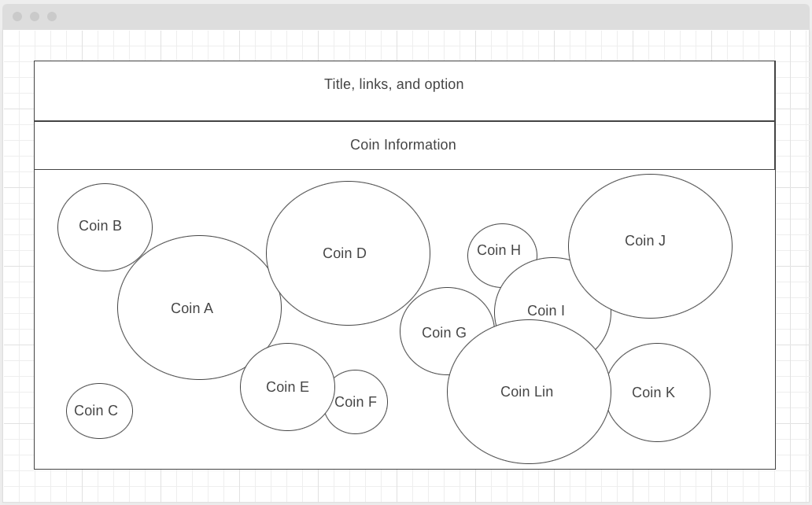

# BubbleMi

## Background

BubbleMi is a data visualization website of top cryptos using API to fetch real time data and presenting the information using a bubble chart.  The bubbles will have varying sizes depending on percentage up/down in the past 24Hr.  The colors of the bubble will be green if the coin is up and red if the coin is down.  Clicking on each bubble will present the user with additional information about each coin.  User is free to interact with bubbles by clicking and dragging them around.  There is an invisible force within the bubbles to slowly move to where they belong.   

## Functionality

In BubbleMi, users will be able to:

* Select the number of bubbles/coins to chart
* Click on the bubble to show additional information on each coin
* Click and drag to move bubbles as they wish
* Click on bubbles to play sound effect
* Links to cryptocurrency exchanges to buy crypto

## Wireframe

* Display page name and logo in HTML headings with links to this project's Github repo and LinkedIn
* Nav Bar includes clickable selection to filter number of coins to show based on Market Capitalization
* Generates bubbles for each coin, bubbles will be split between if the coin is up or down for the day, user will have the ability to move the bubbles around, but the bubbles will slowly move back to it's desired location
* Additional coin information will be shown on the top of the screen under title once a bubble is hover on
* Sound effects will play when a selection is made on the dropdown, pop sound will play when clicking on a bubble

## Technologies, Libraries, APIs:
### Will be using the following on this project: 
* CoinGecko's API to fetch real time data: https://www.coingecko.com/en/api/documentation
* D3's Circular Packing libraries to generate bubbles and data presentation: https://d3-graph-gallery.com/circularpacking.html
* Webpack to bundle JavaScript code
* npm watch and build

## Implementation Timeline: 

* Friday Afternoon & Weekend - Start project, install all dependencies.  Research on libaries that have circular data or bubble charting that are reactive to user input.  Test bubbles and bubble logic according to data fetched.  Create additional information bar and have it only to appear when hover.  Add coin image/logo and text to the bubble and also attached movements of text and logo to the movements of bubbles.  
* Monday - Implement nav and selection bar and add links.  Tweak bubble logic to make sure it scales with outlier data, bubbles are appearing within chart location and are sized appropriately for readiability   
* Tuesday - Tweak more bubble logic to scale with drastic changes of crypto data fetch.  Add more useful coin data to coin information bar and format the information in a way a crypto user would want to see
* Wednesday - Work on styling, visualization, sound effects, and color scheme.  Finally tweak more bubble logic to fit with drastic changes in crypto data fetch.
* Thursday Morning - Push to GitHub report

